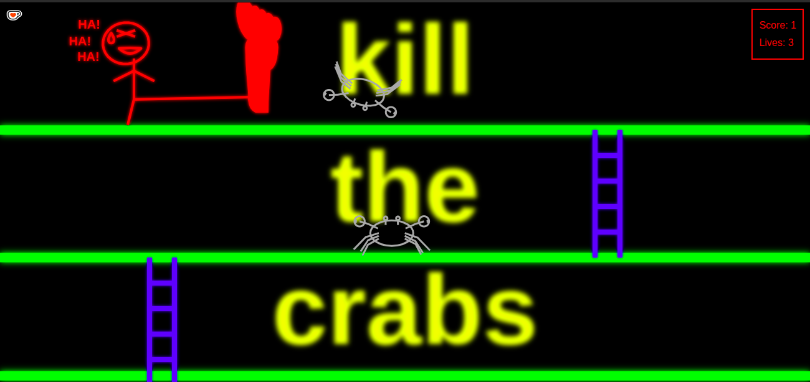

# AI assisted 2D vanilla javascript game - Kill the crabs

> 🛑 **Notice:** Not to be copied. Not to be cloned. Not to be run. This is not production ready. 
> This setup is strictly a proof-of-concept demonstration and does not constitute technical guidance. No claims or guarantees are made regarding code quality, stability, or agent management. Anyone who attempts to replicate or run this code does so entirely at their own risk and assumes full responsibility for any resulting costs, API usage, or system behaviors.

This is an AI-assisted prototype of a 2D vanilla javascript game.
I decided not to include an AGENTS.md file for this project.

play it: [kill-the-crabs](https://mauro-franzoy.github.io/kill-the-crabs/)
